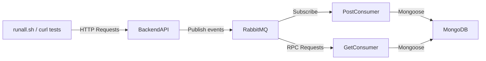

# Technical Case

## Tech Choices
I chose the following technologies:

- **Node.js** (Backend API & Consumers)  
  - Familiar and easy to use for backend development.  

- **MongoDB & Mongoose** (Database & Node.js communication)  
  - Provides flexibility and ease of integration with Node.js.  

- **RabbitMQ** (Message Queue & RPC)  
  - Simple message queue system with good Docker support.  

- **Bash** (Testing & Waiting)  
  - Useful for running multiple test cases and implementing a `wait-for-it.sh` script so consumers wait for RabbitMQ to be up before connecting.  

---

## Folder Structure
```bash
TechnicalCase
|   docker-compose.yml
|   README.md
|   runall.sh
|
+---BackendAPI
|       backend.Dockerfile
|       package-lock.json
|       package.json
|       server.js
|
+---GetConsumer
|       .env
|       get_consumer.Dockerfile
|       get_consumer.js
|       package-lock.json
|       package.json
|       wait-for-it.sh
|
\---PostConsumer
        .env
        package-lock.json
        package.json
        post_consumer.Dockerfile
        post_consumer.js
        wait-for-it.sh
```
- **BackendAPI/** – Node.js backend service handling HTTP requests, validating payloads, and sending/receiving messages from RabbitMQ.  
- **GetConsumer/** – Node.js service consuming messages from the `event-get-rpc` queue.  
- **PostConsumer/** – Node.js service consuming messages from the `event` queue.  
- **docker-compose.yml** – Orchestrates backend, consumers, RabbitMQ, and MongoDB containers.  
- **runall.sh** – Bash script to run automated test cases against the backend API.  
- **wait-for-it.sh** – Bash utility to delay service startup until RabbitMQ is ready.  

---
Flow Chart

---
## RUN

In order to run the project, use **two terminals**:

### Terminal 1
```bash
docker compose up --build
```
- Starts all services (BackendAPI, consumers, RabbitMQ, MongoDB).
- Note: remove existing container of rabbitmq to run w/o failure
### Terminal 2
```bash
./runall.sh
```

- Runs all test cases in runall.sh. 
    - Note: to run 'runall.sh' on windows must use Git Bash, Not Powershell or Command prompt
- For further testing, you can run curl commands against http://localhost:8081/ (the exposed port of the backend).
